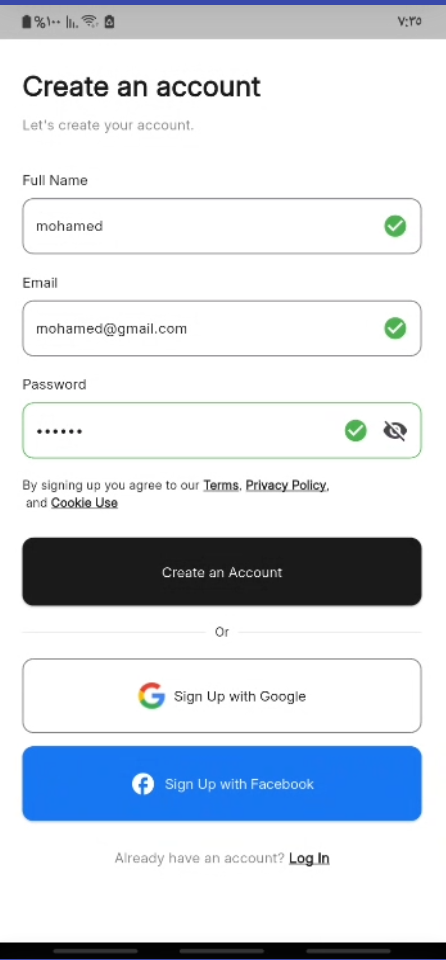
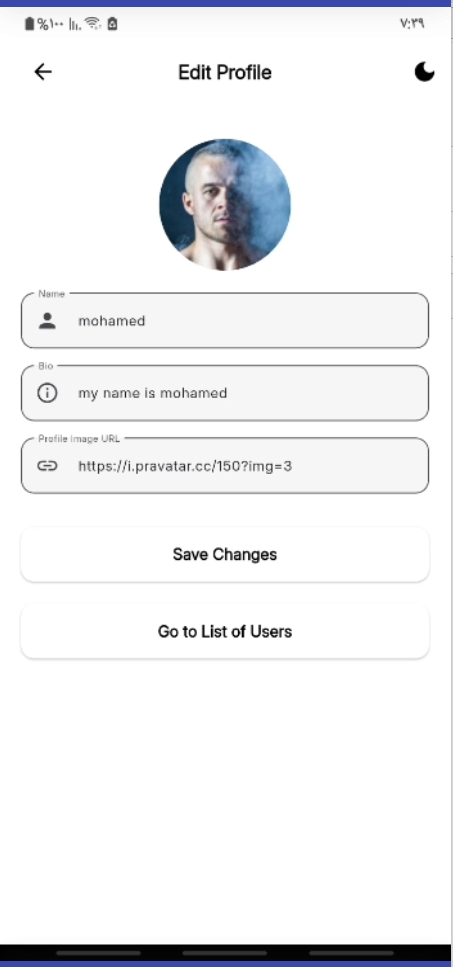
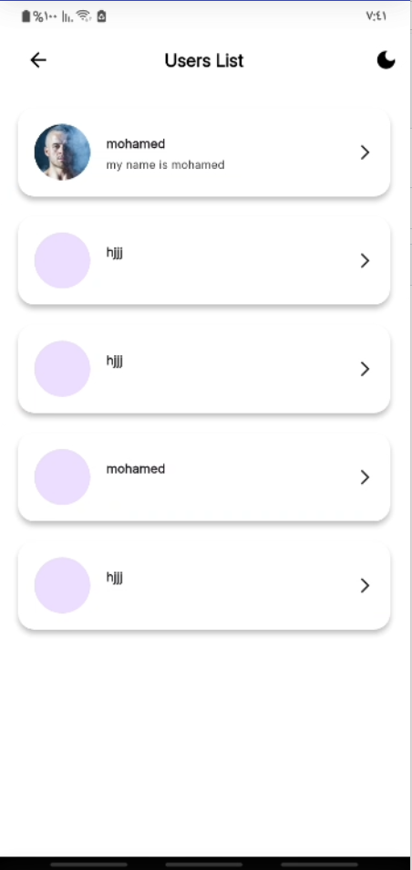
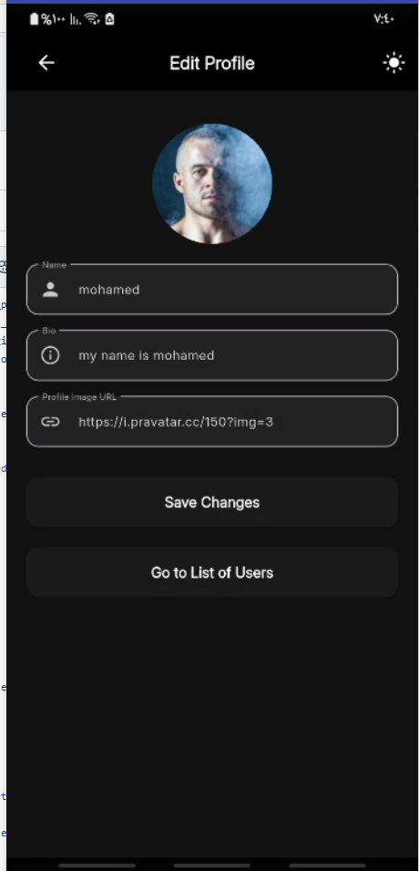
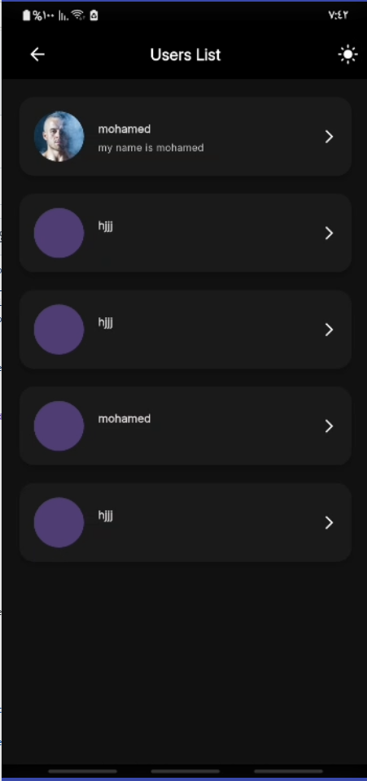

# 📱 MVP User Management App

A **Flutter** mobile application that allows users to log in, manage their profiles, and view a list of other registered users.  
The project demonstrates **clean code**, **Firebase integration**, and **future scalability considerations**.

---

## 🚀 Features

- 🔑 **User Authentication** – Secure login using **Firebase Auth**.
- 📝 **Profile Management** – Edit name, bio, and profile picture.
- 📋 **User List** – View all registered users from **Firebase Firestore**.
- 🌗 **Theme Toggle** – Switch between dark and light modes.
- 📱 **Responsive UI** – Adaptive design for all screen sizes.
- ⏳ **Smooth Loading** – Engaging loading indicators.

---

## 🛠️ Tech Stack

| Category         | Tools / Libraries |
|------------------|-------------------|
| Framework        | Flutter (Dart) |
| Authentication   | Firebase Auth |
| Database         | Firebase Firestore |
| Storage          | Firebase Storage |
| State Management | GetX |
| UI Components    | Flutter Material Widgets |
| Deployment       | APK / TestFlight |

---

## 📦 Installation & Setup

1️⃣ **Clone Repository**
```bash
git clone https://github.com/khaled338/User-Managment-App.git
cd User-Managment-App

| Login& signUp Screen                    | Profile Screen                      | User List                           | Dark Mode                              |
| ------------------------------- | ----------------------------------- | ----------------------------------- | -------------------------------------- |
|  | |  |  |  |  |

⏱️ Time Spent

Total Time: ~ 15 hours

Preparation project: 2 hours

Firebase setup: 1 hours

Authentication: 1 hours

Storage: 2 hours

Firestore: 1 hours

Profile management: 2 hours

User list: 1 hours

Theme toggle & UI polish: 1 hours

Hosting: 2 hours

Testing & debugging: 1 hours

Documentation: 1 hours

## ⚡ Challenges & Solutions

| Challenge                                | Solution |
|-----------                               |----------|
| Firebase authentication integration | Configured Firebase properly and handled async operations. |
| Preventing theme flicker on toggle | Managed state using GetX reactive approach. |
| Firebase Storage required local image upload (e.g., from camera/gallery) but we needed a quick MVP solution | Instead of forcing local uploads, we allowed users to enter an **image URL** from the web. The app fetches and updates the profile picture instantly without needing storage uploads.

🔮 Future Scalability

💬 Chat & Friend Requests – Implement Firestore sub-collections for messaging & connections.

📊 Large Data Optimization – Use pagination and infinite scroll to fetch user data in batches.

🔔 Push Notifications – Add Firebase Cloud Messaging (FCM).

🔍 Advanced Search & Filters – Find users by name, location, or interests.

📥 Live Demo

📱 Link Web: https://managment-user.web.app

💻 GitHub Repository: https://github.com/khaled338/User-Managment-App.git

